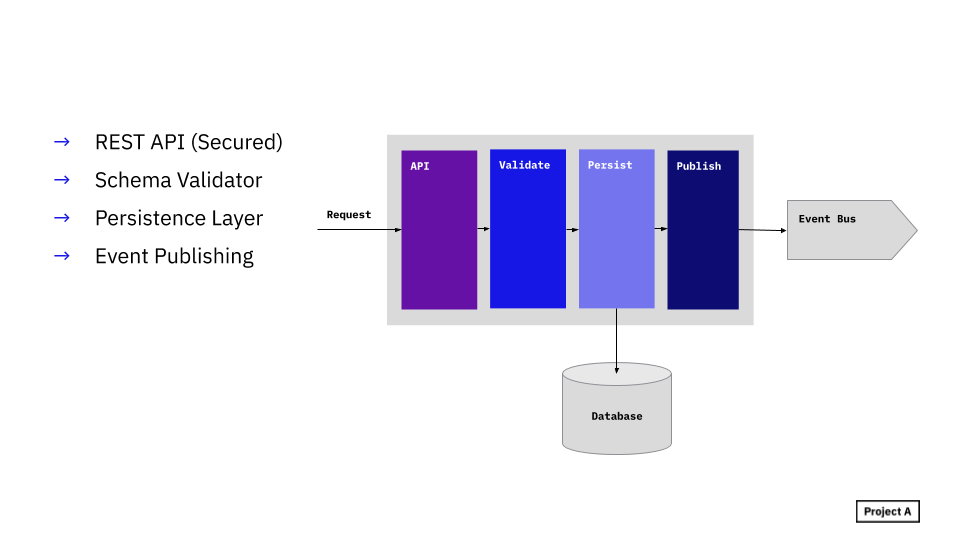

# Core concepts of Wayne

## Business Entity

Business entities are the central data objects that will be stored, validated and distributed from Wayne.


## Schema Registry

The structure of a business entity is defined by a json-file that is based on [json-schema](https://json-schema.org/).
All of this files are part of a specific python package called _schema-registry_, it can be located in your Wayne 
repository or in a separate one.

**Example schema:**
```json
{
  "$schema": "http://json-schema.org/draft-07/schema#",
  "$id": "http://wayne.json-schema/customer/customer_v1.json",
  "title": "Customer",
  "description": "Customer info",
  "type": "object",
  "properties": {
    "customerId": {
      "description": "The unique identifier for a customer",
      "type": "string"
    },
    "firstName": {"type": "string"},
    "lastName": {"type": "string"}
  },
  "required": [ "firstName" ],
  "additionalProperties": false
}
```

## Request Flow


